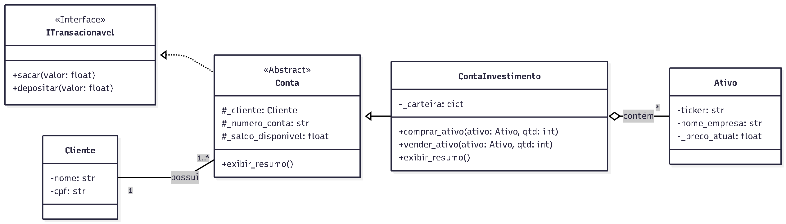

# Projeto: Sistema de Corretora de Valores com POO em Python

## 📖 Sobre o Projeto

Este projeto é o back-end de um sistema de corretora de valores. O objetivo principal é aplicar os 4 pilares da POO (Encapsulamento, Abstração, Herança e Polimorfismo) em um cenário prático e realista.

---

##  UML - Diagrama de Classes

A arquitetura do sistema foi planejada utilizando o seguinte diagrama de classes UML.



---

## 🚀 Funcionalidades

- **Gerenciamento de Clientes e Contas:** Criação e gestão de clientes e suas respectivas contas de investimento.
- **Operações Financeiras:** Métodos seguros para depositar e sacar valores.
- **Home Broker:** Funcionalidades para comprar e vender ativos financeiros.
- **Segurança e Encapsulamento:** Utilização de getters, setters e atributos privados para garantir a integridade dos dados.

---

## 🛠️ Tecnologias Utilizadas

- Python 3
- Git & GitHub para versionamento de código

---

## 🏃 Como Executar

1. Clone o repositório:
   ```bash
   git clone [https://github.com/seu-usuario/corretora-poo-python.git](https://github.com/seu-usuario/corretora-poo-python.git)